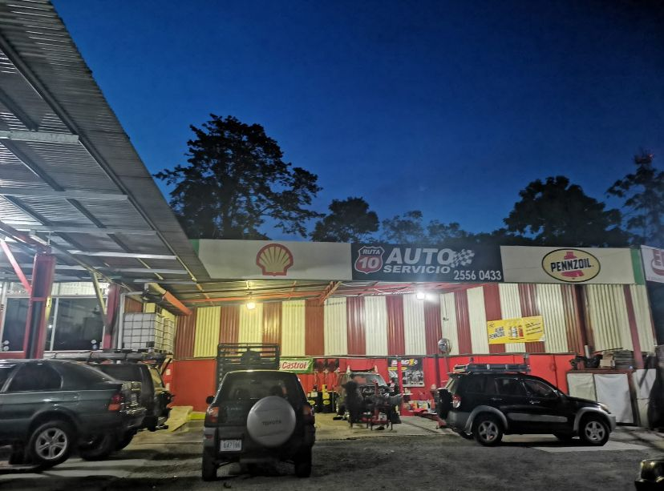
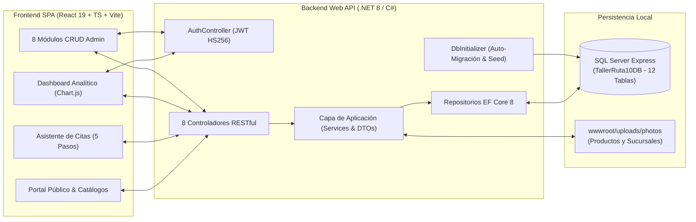

<div align="center">

# Auto Servicio Ruta 10

**Plataforma web integral y sistema de gestión administrativa multi-sucursal para taller mecánico automotriz en Turrialba, Costa Rica.**

[](https://github.com/Mangelbarboza/TallerRuta10/actions)
[](https://dotnet.microsoft.com/)
[](https://learn.microsoft.com/dotnet/csharp/)
[](https://learn.microsoft.com/ef/core/)
[](https://react.dev/)
[](https://www.typescriptlang.org/)
[](https://tailwindcss.com/)
[](https://vite.dev/)

<p align="center">
  <a href="#instalación-y-ejecución-local"><strong>Ejecución en 1 Clic</strong></a> ·
  <a href="./docs/ARCHITECTURE.md"><strong>Arquitectura y Modelo de Datos (12 Tablas)</strong></a> ·
  <a href="#características-principales"><strong>Módulos del Sistema</strong></a>
</p>

</div>

---

## Descripción del Proyecto

**Auto Servicio Ruta 10** es una solución Full-Stack desarrollada para digitalizar y centralizar la operación de un taller mecánico automotriz con múltiples sedes en Turrialba (**Sede Central Turrialba** y **Sucursal Las Américas**).

El sistema unifica dos experiencias conectadas en tiempo real a través de una API RESTful en **.NET 8**:
1. **Portal Web Público para Clientes:** Permite consultar el catálogo actualizado de servicios mecánicos, repuestos y lubricantes con cálculo automático de descuentos promocionales, ubicar las sucursales en Google Maps y **agendar citas en línea** mediante un asistente guiado de 5 pasos o cotizar vía WhatsApp.
2. **Panel Administrativo y ERP de Taller:** Protegido mediante autenticación **JWT (`HS256`)**, ofrece un **Dashboard Analítico en tiempo real** con indicadores clave (KPIs) y gráficos interactivos, junto con **8 módulos CRUD completos** para administrar sucursales, inventario distribuido por sede, servicios, promociones, proveedores, empleados, clientes y control de estados de citas.

---

## Galería del Taller y Sedes en Turrialba

| Sede Central Turrialba (Exterior) | Área de Elevadores y Diagnóstico | Imagen Principal del Portal Web |
| :---: | :---: | :---: |
|  |  |  |

---

## Características Principales

### Aspectos Técnicos Destacados
- **Motor de Agendamiento con Cálculo Dinámico de Disponibilidad Horaria:**
  El asistente multipaso ([`AppointmentModal.tsx`](./frontend/src/components/molecules/AppointmentModal/AppointmentModal.tsx)) interpreta automáticamente la jornada laboral configurada en cada sucursal (ej. `Lunes a Sábado 08:00-17:00`), genera bloques de 30 minutos y filtra en tiempo real los horarios ya ocupados en la sede y fecha seleccionadas. Además, adapta su interfaz según el contexto (`isPublic`): en la web pública presenta un formulario limpio para el cliente, mientras que en el panel administrativo habilita búsqueda en el padrón de clientes o registro rápido.
- **Dashboard Analítico Interactivo con Filtrado por Sede:**
  El módulo de reportes ([`GraficosDashboard.tsx`](./frontend/src/components/templates/GraficosDashboard.tsx) y [`DashboardGrid.tsx`](./frontend/src/components/organisms/graficos/DashboardGrid.tsx)) integra **Chart.js** (`Doughnut` de distribución de estados y `Bar` de citas completadas por día con navegación semanal), tarjetas KPI interactivas con modales de desglose (*Citas pendientes*, *Citas en proceso*, *Ofertas próximas a vencer en 14 días*, *Empleados activos*) y listado de las próximas 5 citas confirmadas.
- **Inventario Multi-Sucursal y Motor de Ofertas Vigentes:**
  Los productos ([`ProductService.cs`](./backend/Taller_back/Application/Services/ProductService.cs)) mantienen existencias independientes por sucursal mediante la entidad asociativa `BranchProduct`, mientras que los servicios ([`ServiceService.cs`](./backend/Taller_back/Application/Services/ServiceService.cs)) se vinculan dinámicamente a las sedes donde se imparten (`BranchService`). Tanto productos como servicios evalúan en el servidor la vigencia de su oferta asociada (`Offer.IsActive && Offer.EndDate >= Today`) antes de exponer descuentos al cliente.
- **Inicialización, Auto-Verificación y Seeding Automático de Base de Datos:**
  Al arrancar el Backend, [`DbInitializer.cs`](./backend/Taller_back/Infraestructure/DbInitializer.cs) verifica el esquema en SQL Server (`TallerRuta10DB`), crea automáticamente las **12 tablas relacionales** si no existen y siembra datos realistas de operación en Turrialba (administradores, sucursales con fotografías reales, proveedores, ofertas, productos con stock, servicios, empleados, clientes y citas en distintos estados).
- **Validación de Placas de Costa Rica y Notificaciones SMTP Tolerantes a Fallos:**
  Incluye validador especializado ([`validators.ts`](./frontend/src/utils/validators.ts)) para formatos de placas costarricenses (particulares `ABC-123` / `123456`, motocicletas, carga liviana `CL`, taxis y gobierno) y servicio de correo [`SmtpEmailSender.cs`](./backend/Taller_back/Infraestructure/Email/SmtpEmailSender.cs) asíncrono que envía confirmaciones de cita sin bloquear la transacción si el servidor SMTP no está configurado localmente.

---

## Arquitectura del Sistema

> **Documentación completa:** Para consultar el **Diagrama Entidad-Relación de las 12 tablas**, el catálogo detallado de **Endpoints RESTful** y las decisiones de arquitectura (ADRs), revisá [**`docs/ARCHITECTURE.md`**](./docs/ARCHITECTURE.md).



---

## Stack Tecnológico

| Categoría | Tecnologías Implementadas |
| :--- | :--- |
| **Backend Core** | ASP.NET Core `8.0` Web API, C# `12`, Arquitectura en Capas (`Api`, `Application`, `Domain`, `Infraestructure`) |
| **ORM & Base de Datos** | Entity Framework Core `8.0.2`, Microsoft SQL Server / SQL Server Express (`TallerRuta10DB`) |
| **Seguridad & Autenticación** | JWT Bearer Authentication (`Microsoft.AspNetCore.Authentication.JwtBearer`), `BCrypt.Net-Next`, Swagger OpenAPI con esquema Bearer |
| **Frontend Core** | React `19.2`, TypeScript `5.9`, Vite `7.3`, Metodología **Atomic Design** |
| **Enrutamiento & Visualización** | React Router DOM `7.13`, Chart.js `4.5` + `react-chartjs-2`, Lucide React Icons |
| **Estilos & UI** | Tailwind CSS `3.4`, CSS Modules, Diseño Responsivo con modales reutilizables y paginación |
| **Automatización & CI** | Lanzador Windows en 1 clic (`Iniciar_TallerRuta10.bat`), GitHub Actions CI (`.NET 8` + `Vite Build`) |

---

## Estructura del Proyecto

```text
TallerRuta10/
├── .github/workflows/
│   └── ci.yml                             # Pipeline CI: Build .NET 8 API + TypeScript & Vite Build
├── backend/
│   ├── Taller_back.sln                    # Solución de Visual Studio (.NET 8)
│   └── Taller_back/
│       ├── Api/Controllers/               # 11 Controladores REST (Auth, Branch, Product, Service, Offer, etc.)
│       ├── Application/
│       │   ├── DTOs/                      # Objetos de transferencia de datos por módulo
│       │   ├── Interface/                 # Contratos de servicios y repositorios
│       │   └── Services/                  # Lógica de negocio, validaciones y manejo de archivos
│       ├── Domain/                        # 12 Entidades del modelo de dominio
│       ├── Infraestructure/
│       │   ├── Email/                     # Envío de confirmaciones por correo (SmtpEmailSender)
│       │   ├── Repository/                # Implementación de repositorios con EF Core
│       │   ├── Settings/Dependencies.cs   # Contenedor de Inyección de Dependencias (DI)
│       │   ├── ApplicationDBContext.cs    # Configuración Fluent API de las 12 tablas
│       │   └── DbInitializer.cs           # Creación automática de esquema y datos semilla
│       ├── wwwroot/uploads/photos/        # Fotografías de sucursales y productos
│       ├── appsettings.json               # Configuración de conexión SQL Server, JWT y SMTP
│       └── Program.cs                     # Punto de entrada, middleware CORS, Auth, StaticFiles y Seeder
├── frontend/
│   ├── public/                            # Recursos estáticos e imagen hero del taller
│   ├── src/
│   │   ├── components/
│   │   │   ├── atoms/                     # Botones, selectores, íconos SVG y utilidades base
│   │   │   ├── molecules/                 # Modales (AppointmentModal, EmployeeModal, FeedbackModal, etc.)
│   │   │   ├── organisms/                 # DashboardGrid, GenericTable, Sidebar, secciones de Landing
│   │   │   └── templates/                 # AdminLayout, AuthLayout, GraficosDashboard, ModuleTemplate
│   │   ├── hooks/                         # Custom hooks (useAppointments, useEmployees, usePagination)
│   │   ├── pages/
│   │   │   ├── admin/                     # 9 vistas administrativas (Graficos, Citas, Productos, etc.)
│   │   │   ├── public/                    # LandingPage y catálogos completos de productos/servicios/ofertas
│   │   │   └── LoginAdmin.tsx             # Autenticación JWT con acceso rápido de demostración
│   │   ├── routes/AppRouter.tsx           # Definición de rutas públicas y guard RequireAuth
│   │   ├── services/api/                  # Cliente HTTP centralizado con inyección de Bearer Token
│   │   └── utils/validators.ts            # Validadores de placas de Costa Rica, teléfonos, fechas y correo
│   ├── package.json
│   └── vite.config.ts
├── docs/
│   ├── ARCHITECTURE.md                    # Diagrama ER, arquitectura detallada y catálogo de endpoints
│   └── scrum/                             # Documentación de Sprints y Retrospectivas del proyecto
├── Iniciar_TallerRuta10.bat               # Script lanzador en 1 clic (Backend + BD + Frontend + Navegador)
├── Detener_TallerRuta10.bat               # Script para detener todos los servidores activos
└── README.md
```

---

## Instalación y Ejecución Local

### Prerrequisitos
- **.NET 8.0 SDK**
- **SQL Server Express** (`localhost\SQLEXPRESS`) ejecutándose localmente
- **Node.js** `v20+` y **npm**

### Opción A: Ejecución Automática en 1 Clic (Recomendado en Windows)
En la raíz del proyecto, ejecutá con doble clic:
```bat
Iniciar_TallerRuta10.bat
```
El script se encarga automáticamente de:
1. Confiar en el certificado HTTPS de desarrollo de .NET (`dotnet dev-certs https --trust`).
2. Instalar las dependencias de Node.js en `frontend/` si aún no existen.
3. Levantar el **Backend API** en `https://localhost:7265` y crear/poblar automáticamente la base de datos **`TallerRuta10DB`** en `localhost\SQLEXPRESS`.
4. Levantar el **Frontend Web** en `http://localhost:5173` y abrir el navegador junto con la documentación interactiva **Swagger** (`https://localhost:7265/swagger`).

Para cerrar ambos servidores cuando termines de probar, ejecutá **`Detener_TallerRuta10.bat`**.

### Opción B: Ejecución Manual por Terminal

**1. Iniciar el Backend (.NET 8):**
```bash
cd backend/Taller_back
dotnet restore
dotnet run --launch-profile https
```

**2. Iniciar el Frontend (React + Vite):**
```bash
cd frontend
npm install
npm run dev
```

### Credenciales de Acceso Administrativo (`http://localhost:5173/admin/login`)

| Rol | Usuario / Correo | Contraseña |
| :--- | :--- | :--- |
| **Administrador Principal** | `admin` *(o `admin@tallerruta10.com`)* | `Admin123!` |
| **Administrador Secundario** | `Leo Cortés` *(o `leo@tallerruta10.com`)* | `123456` |

*(La pantalla de Login incluye además un botón de **Autocompletar** para agilizar las pruebas locales).*

---

## Equipo de Desarrollo

Proyecto desarrollado en la **Universidad de Costa Rica (Sede del Atlántico — Recinto de Turrialba)**:

- **Angel Barboza Reyes** — [@Mangelbarboza](https://github.com/Mangelbarboza)
- **Joshua Céspedes Gómez** — [@joshua-cespedes](https://github.com/joshua-cespedes)
- **Melany Morales**
- **Jordy Hernández**
