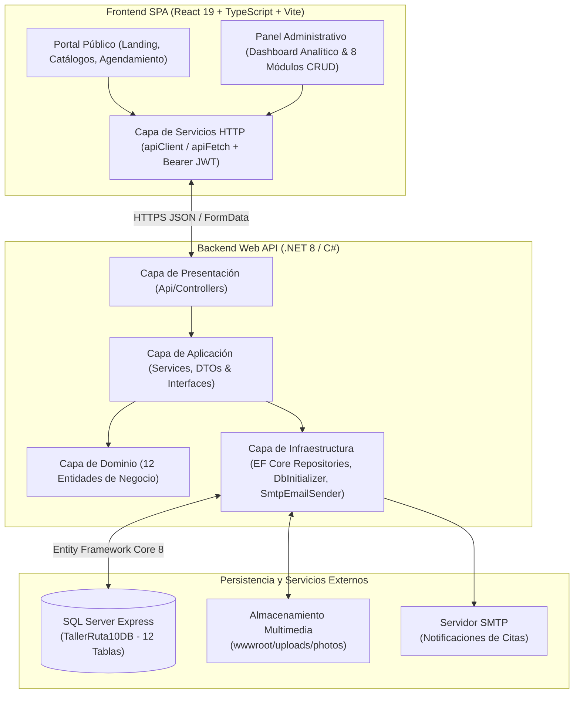
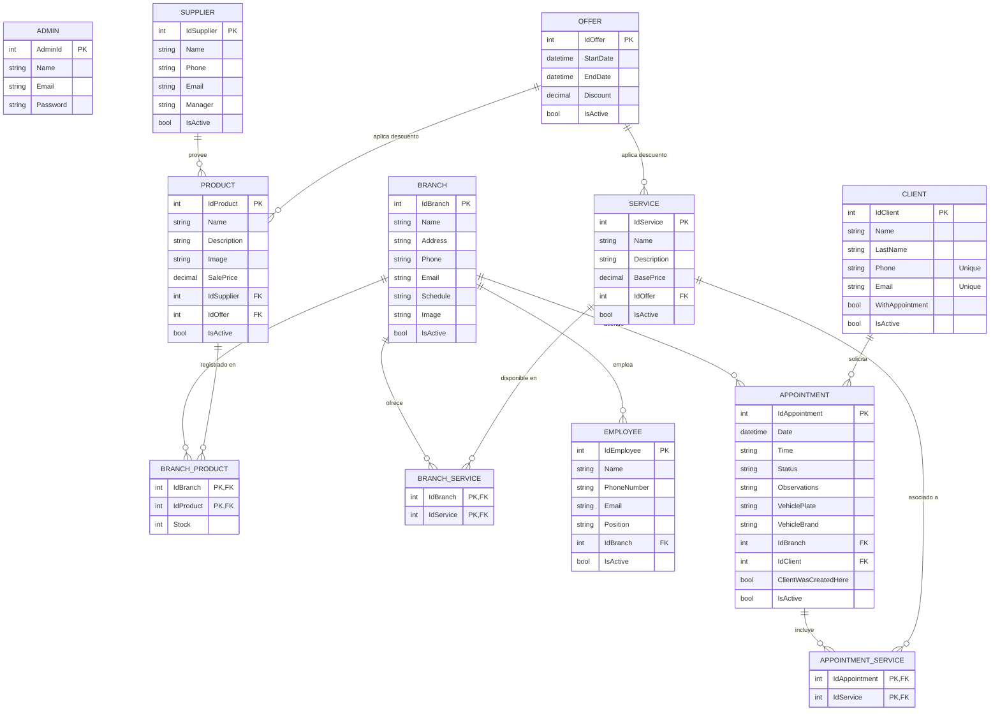

# Arquitectura y Modelo de Datos — Auto Servicio Ruta 10

Este documento detalla la arquitectura de software, el diseño de la base de datos relacional (**SQL Server**), el catálogo de endpoints RESTful y los flujos de seguridad implementados en **Auto Servicio Ruta 10**.

---

## 1. Arquitectura en Capas (Backend .NET 8 + Frontend Atomic Design)

El sistema implementa una separación estricta entre el cliente SPA (**React 19 + TypeScript + Vite**) organizado bajo la metodología **Atomic Design** (`atoms`, `molecules`, `organisms`, `templates`, `pages`) y una API RESTful construida en **ASP.NET Core 8 (`C#`)** bajo principios de **Arquitectura en Capas (Clean/Layered Architecture)**:

---

## 2. Diagrama Entidad-Relación (12 Tablas en SQL Server)

La base de datos `TallerRuta10DB` modela la operación multi-sucursal del taller mecánico en Turrialba, incluyendo inventario distribuido por sede (`BranchProduct`), disponibilidad de servicios por sucursal (`BranchService`), servicios múltiples por cita (`AppointmentService`) y descuentos promocionales aplicables tanto a productos como a servicios (`Offer`).

---

## 3. Catálogo de Endpoints RESTful

| Controlador | Método | Ruta | Autenticación | Descripción |
| :--- | :---: | :--- | :---: | :--- |
| **Auth** | `POST` | `/api/Auth/login` | Público | Valida credenciales (texto plano o hash `BCrypt`) y emite un JWT firmado (`HS256`, vigencia 8h). |
| **Branch** | `GET` | `/api/Branch` | Público | Lista todas las sucursales activas con horario, dirección, teléfono y fotografía. |
| **Branch** | `POST` | `/api/Branch` | `Bearer JWT` | Crea una nueva sucursal (`multipart/form-data` con carga de imagen en `wwwroot/uploads/photos/sucursales`). |
| **Branch** | `PUT` | `/api/Branch/{id}` | `Bearer JWT` | Actualiza datos, horario y fotografía de una sucursal existente. |
| **Branch** | `DELETE` | `/api/Branch/{id}` | `Bearer JWT` | Realiza borrado lógico (`IsActive = false`) de la sucursal. |
| **Product** | `GET` | `/api/Product` | Público | Devuelve el catálogo activo de productos con proveedor, imagen y descuento vigente calculado. |
| **Product** | `GET` | `/api/Product/{id}` | Público | Obtiene el detalle de un producto junto con el inventario (`Stock`) desglosado por sucursal. |
| **Product** | `POST` | `/api/Product` | `Bearer JWT` | Registra un producto (`multipart/form-data`), su oferta opcional y su stock inicial por sucursal. |
| **Product** | `PUT` | `/api/Product/{id}` | `Bearer JWT` | Actualiza datos del producto, imagen, oferta y stock por sucursal. |
| **Product** | `DELETE` | `/api/Product/{id}` | `Bearer JWT` | Borrado lógico (`IsActive = false`) del producto. |
| **Service** | `GET` | `/api/Service` | Público | Lista los servicios activos con su precio base, oferta vigente y `branchIds` asociados. |
| **Service** | `GET` | `/api/Service/{id}` | Público | Obtiene el detalle de un servicio y las sucursales donde se imparte. |
| **Service** | `POST` | `/api/Service` | `Bearer JWT` | Crea un servicio y registra sus asociaciones en la tabla intermedia `BranchService`. |
| **Service** | `PUT` | `/api/Service/{id}` | `Bearer JWT` | Actualiza el servicio y sincroniza altas/bajas de sucursales en `BranchService`. |
| **Service** | `DELETE` | `/api/Service/{id}` | `Bearer JWT` | Borrado lógico (`IsActive = false`) del servicio. |
| **Offer** | `GET` | `/api/Offer` | Público | Lista todas las promociones registradas. |
| **Offer** | `GET` | `/api/Offer/active` | Público | Devuelve únicamente las ofertas activas y vigentes a la fecha actual. |
| **Offer** | `POST` | `/api/Offer` | `Bearer JWT` | Crea una oferta validando coherencia de rangos (`StartDate <= EndDate`). |
| **Offer** | `PUT` | `/api/Offer/{id}` | `Bearer JWT` | Actualiza porcentaje de descuento y vigencia de una oferta. |
| **Offer** | `DELETE` | `/api/Offer/{id}` | `Bearer JWT` | Desactiva lógicamente una oferta. |
| **Supplier** | `GET` | `/api/Supplier` | Público | Lista los proveedores activos de repuestos e insumos. |
| **Supplier** | `POST / PUT / DELETE` | `/api/Supplier` | `Bearer JWT` | Operaciones CRUD completas de proveedores con borrado lógico. |
| **Employee** | `GET / POST / PUT / DELETE` | `/api/Employee` | `Bearer JWT` | Gestión de personal técnico y administrativo asignado a cada sucursal. |
| **Client** | `GET / POST / PUT / DELETE` | `/api/Client` | `Bearer JWT` (`GET` público) | Gestión de clientes con índices únicos en `Phone` y `Email` y estado `WithAppointment`. |
| **Appointment** | `GET` | `/api/Appointment` | Público | Lista todas las citas activas con cliente, sucursal y lista de servicios contratados. |
| **Appointment** | `POST` | `/api/Appointment` | Público | Agenda una cita permitiendo reutilizar un cliente existente o registrar uno nuevo automáticamente, calculando disponibilidad horaria y enviando confirmación por correo. |
| **Appointment** | `PUT` | `/api/Appointment/{id}` | Público / Admin | Actualiza fecha, hora, sucursal, servicios o estado (`Pendiente`, `Confirmada`, `En Proceso`, `Completada`, `Cancelada`). |
| **Appointment** | `DELETE` | `/api/Appointment/{id}` | `Bearer JWT` | Borrado lógico de una cita. |

---

## 4. Decisiones Técnicas Clave (ADRs)

1. **Inicialización y Auto-Reparación de Base de Datos (`DbInitializer.cs`):**
   Al iniciar la aplicación, `DbInitializer.SeedAsync` verifica la existencia y compatibilidad del esquema en SQL Server (`TallerRuta10DB`). Si la base de datos no existe o proviene de una migración antigua incompleta, reconstruye automáticamente las 12 tablas y siembra un conjunto completo de datos realistas (2 administradores, 2 sucursales en Turrialba, 3 proveedores, 3 ofertas, 6 productos con stock, 6 servicios, 5 empleados, 5 clientes y 8 citas en distintos estados).
2. **Separación de Flujo Público vs. Administrativo en Agendamiento de Citas (`isPublic`):**
   El componente `AppointmentModal` opera en dos modos: en el panel administrativo permite buscar y seleccionar clientes existentes del taller o registrar nuevos; en el portal público (`isPublic={true}`) bloquea la exposición del padrón de clientes y presenta únicamente el asistente simplificado de 5 pasos con cálculo dinámico de horarios disponibles según el horario (`Schedule`) de la sucursal elegida y las citas ya ocupadas en esa fecha.
3. **Borrado Lógico Consistente (`Soft Delete`):**
   Todas las entidades principales (`Branch`, `Product`, `Service`, `Offer`, `Supplier`, `Employee`, `Client`, `Appointment`) utilizan la bandera `IsActive` para preservar la integridad referencial del historial de citas y reportes analíticos.
